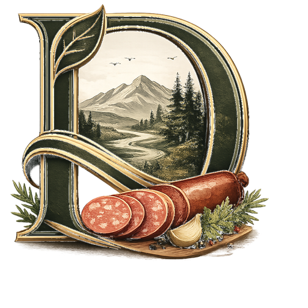

# DASTIN

<p align="center">
  
</p>

<p align="center">
  <strong>طعم دست‌ساز برای لحظه‌های واقعی</strong>
</p>

<p align="center">
  سایت رسمی DASTIN برای محصولات خانگی؛ فینگر فود، برگر، محصولات دودی، کیک و شیرینی
</p>

---

## دربارهٔ DASTIN

DASTIN یک تجربهٔ دیجیتال فارسی و RTL برای نمایش طعم‌های دست‌ساز است. طراحی سایت از فضای طبیعی، نور، چوب، گیاهان تازه و حس گرم آشپزخانه الهام گرفته شده تا هویت خانگی و لوکس برند را هم‌زمان نشان دهد.

## تجربهٔ سایت

- اینتروی انیمیشنی همراه با لوگوی برند
- پس‌زمینهٔ ویدئویی طبیعی و زنده
- کاتالوگ محصولات با امکان مشاهدهٔ جزئیات هر محصول
- نمایش قیمت، وزن، توضیحات و حق کپی‌رایت محصولات
- ارتباط از طریق Instagram، WhatsApp، Telegram و Email
- سازگار با موبایل، تبلت و دسکتاپ
- پشتیبانی از کاهش حرکت برای کاربران حساس به انیمیشن

## فناوری

این سایت به‌صورت کاملاً static ساخته شده است:

```text
HTML + CSS + Vanilla JavaScript
```

نیازی به نصب پکیج، npm یا build process ندارد و برای میزبانی روی سرویس‌های static آماده است.

## انتشار

### GitHub Pages

1. محتویات repository را در branch اصلی قرار دهید.
2. در GitHub به مسیر زیر بروید:

   ```text
   Settings → Pages
   ```

3. گزینه‌های زیر را انتخاب کنید:

   ```text
   Source: Deploy from a branch
   Branch: main
   Folder: /(root)
   ```

4. تنظیمات را ذخیره کنید.

### Cloudflare Pages

در زمان ساخت پروژه، تنظیمات زیر را انتخاب کنید:

```text
Framework preset: None
Build command: خالی
Build output directory: .
```

## هویت بصری

لوگوی DASTIN، تصویرهای محصولات و عناصر بصری این repository بخشی از هویت برند هستند.

---

© DASTIN — All rights reserved
